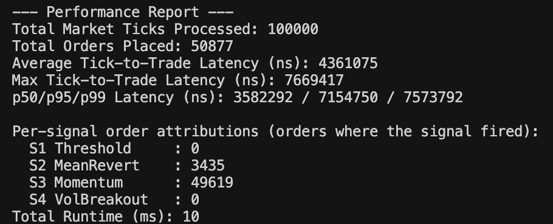
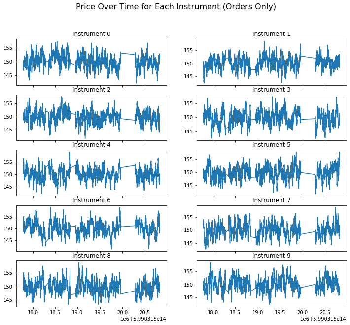

# Build Instruction
```bash
g++ -O3 -march=native -std=c++20 hft_sim.cpp -o hft_sim
```

# Answers

From the performance report, Signal 3 (Momentum) triggered by far the most orders, with about 49,619 orders, while Signal 2 (Mean Reversion) contributed only 3,435, and both Signal 1 (Threshold) and Signal 4 (Volatility Breakout) did not fire at all. This indicates that in the simulated market data, short bursts of consecutive up or down moves are common, so the momentum strategy dominates order generation.

Further optimization could focus on data structures and memory handling. Currently, price history is stored in std::vector and updated with erase(begin()), which is inefficient for sliding windows. Replacing this with a ring buffer (circular buffer) would make updates O(1). Pre-allocating space for orders and latency measurementg++ -O3 -march=native -std=c++20 hft_sim.cpp -o hft_sims, or writing orders directly to disk in batches, would also reduce dynamic allocation overhead. At the extreme, lock-free queues and NUMA-aware memory placement could help lower latency.

If the input size grows 10× larger (one million ticks), the algorithm should still scale linearly since the complexity is O(n). Runtime would increase from ~10 ms to roughly ~100 ms on the same machine, which is still manageable. Memory usage, however, would grow significantly due to storing more orders and latency values. For very large workloads, streaming or partial aggregation would help keep memory bounded.

# Appendix

**Screenshot with the console output**


**Visualize tick prices in orders**
